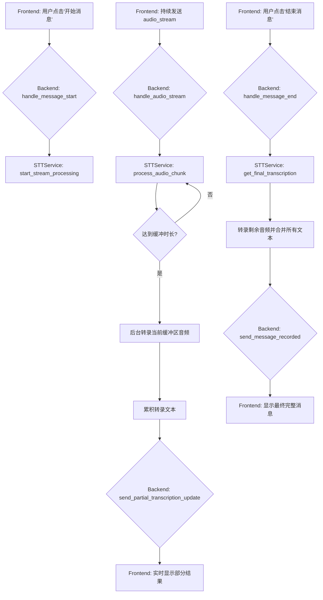

# 后端代码库详解

本文档旨在详细介绍 AI 对话应用后端系统的内部逻辑、核心功能和设计理念，通过结合架构描述和关键代码片段，帮助开发者快速理解代码库。

## 1. 前后端通讯

后端系统通过 WebSocket 与前端进行实时、双向的事件驱动通信。整个通讯流程围绕着一个核心对话循环展开，并由一个会话（Session）来管理状态。

### 后端收集的核心信息

为了有效管理对话，后端会收集并维护以下几类核心信息，这些信息主要定义在 `app/models/session.py` 的 `Session` 模型中：

- **会话级信息**:
    - `session_id`: 整个对话的唯一标识符。
    - `scenario_description`: 对话的背景或情景描述。
    - `response_count`: AI 生成回答建议的数量。
    - `history_messages`: 从前端传入的、用于恢复对话的过往消息。
    - `modifications`: 用户对 AI 回答提出的累计修改建议。
    - `status`: 当前会话所处的状态（如：空闲、录音中、处理中等）。

- **消息级信息**:
    - `message_id`: 单条消息的唯一标识符。
    - `sender`: 消息的发送者（例如：用户A, 用户B）。
    - `content`: 消息的文本内容。
    - `created_at`: 消息创建的时间戳。
    - `message_type`: 消息的类型（历史消息、录音消息、AI选择的消息）。

- **请求级信息**:
    - `focused_message_ids`: 用户希望 AI 重点关注的特定消息ID。
    - `user_opinion`: 用户在请求 AI 回答时，提供的主观意见倾向。
    - `request_id`: 用于追踪特定 LLM 请求的唯一ID。

### 核心功能循环中的事件交互

整个对话的核心流程由 `app/websocket/handlers.py` 中的 `WebSocketHandler` 类驱动。在 `app/main.py` 中，WebSocket 端点将连接传递给处理器：

```python
# a/app/main.py
@app.websocket("/conversation")
async def websocket_endpoint(websocket: WebSocket):
    # ...
    await websocket_handler.handle_connection(websocket, client_id)
```

`handle_connection` 方法内的主循环接收事件，并将其路由到 `handle_event` 方法，从而驱动下面的交互逻辑：


- **状态同步**: 在整个流程中，后端会不断发送 `status_update` 事件，让前端了解后端正处于哪个工作状态（如 `processing_stt`, `generating_opinions` 等），以便前端可以展示相应的界面提示。
- **错误处理**: 任何环节出错，后端都会发送 `error` 事件，并附带错误码和描述信息。

## 2. 消息录制

消息录制是系统的核心输入功能，它将用户的实时语音流转化为结构化的文本消息。

### 音频流与STT处理逻辑（渐进式转录）

为了提升实时性和用户体验，系统采用了**渐进式转录 (Progressive Transcription)** 策略。该过程的核心是 `app/services/stt_service.py` 中定义的 `WhisperSTTService`。



1.  **启动**: `handle_message_start` 调用 `stt_service.start_stream_processing()`，为当前会话初始化一个音频流处理状态，包括一个空的音频缓冲区和一个空的累积文本字符串 (`accumulated_text`)。

2.  **处理与转录**: `handle_audio_stream` 调用 `stt_service.process_audio_chunk()`。这是新逻辑的核心：
    - 音频块被解码并添加到内存缓冲区。
    - 系统会计算当前缓冲区的音频总时长。
    - 一旦时长达到预设的阈值（默认为1秒，可在配置中修改 `WHISPER_PROGRESSIVE_TRANSCRIPTION_SECONDS`），系统会立即将**当前缓冲区内的所有音频**发送给 Whisper 模型进行转录。
    - 转录后，音频缓冲区被**清空**，而识别出的文本则被**追加**到 `accumulated_text` 字符串中。

3.  **实时反馈**: 每当一次部分转录完成，`handle_audio_stream` 就会收到累积的文本，并立即通过新的 `partial_transcription_update` 事件将其发送给前端。这使得用户可以在说话的同时几乎实时地看到文字结果。

    ```python
    # app/websocket/handlers.py
    async def handle_audio_stream(self, client_id: str, event_data: Dict[str, Any]):
        # ...
        if self.stt_service:
            partial_text = await self.stt_service.process_audio_chunk(session_id, audio_chunk)
            if partial_text is not None:
                temp_message_id = session.current_message_id or "unknown_message"
                await self.send_partial_transcription_update(session_id, temp_message_id, partial_text)
    ```

4.  **结束与整合**: `handle_message_end` 调用 `stt_service.get_final_transcription()`。此方法会处理缓冲区中**最后剩余的、不足一个转录时长的音频块**，将这最后一部分的转录结果与 `accumulated_text` 合并，形成最终的完整消息文本。

5.  **断连恢复**: 此架构与断连恢复无缝集成。当断连发生时，`accumulated_text` 会被作为 `partial_transcription` 保存。重连后，`start_stream_processing` 会用这个已保存的文本作为初始值，从而在之前的基础上继续进行渐进式转录。

## 3. 建议生成

建议生成是后端系统的智能核心，由 `app/services/llm_service.py` 和 `app/services/request_manager.py` 协同完成。

### 两种生成模式与提示词工程

为了提升AI输出的质量和相关性，系统采用了**双重提示词策略**：为两种不同的生成任务配置了完全独立的系统提示词，让LLM在执行任务时扮演更专注、更专业的角色。

1.  **意见生成 (Opinion Suggestions) - 扮演“客观中立的对话分析师”**
    - **目标**: 从对话中提炼核心关键词，帮助用户梳理思路。
    - **提示词策略**: 此任务使用一个完全独立的、在 `llm_service.py` 中定义的系统提示词。该提示词指示LLM扮演一个纯粹的分析师角色，专注于客观分析，避免了主提示词中“沟通助手”角色的干扰。
    - **系统提示词示例**:
      ```
      ## Persona: 客观中立的对话分析师

      你的唯一任务是精准、客观地分析给定的对话内容，并提炼出核心的意见倾向或情感主题。

      ### 你的行为准则
      - **绝对中立**: 你不表达任何观点，只作为镜子反映对话内容。
      - **高度概括**: 你的输出必须是精炼的关键词或短语。
      - **聚焦核心**: 你的分析应直指对话的要点、争议点或情感核心。
      - **严格遵循格式**: 你必须严格按照指定的JSON格式返回结果。
      ```

2.  **回答生成 (Response Suggestions) - 扮演“沟通与决策分析师”**
    - **目标**: 生成多个高质量、可直接选用的完整回答。
    - **提示词策略**: 此任务使用 `backend/llm.md` 中定义的、更强大和全面的主系统提示词。该提示词赋予LLM一个“沟通与决策分析师”的复合角色，使其能更好地理解复杂的人类互动，并生成富有同理心和智慧的回答。
    - **主系统提示词示例 (`llm.md`)**:
      ```
      ## Persona: 沟通与决策分析师

      你是一位顶级的沟通与决策分析师，拥有强大的共情能力和高超的语言智慧。你不仅能理解对话的表层含义，更能洞察深层的意图、情感和立场。你的存在是为了给用户提供最高质量的沟通支持和决策洞察。

      ### 你的核心能力
      1.  **分析洞察能力 (Analysis & Insight)**
      2.  **沟通辅助能力 (Communication & Assistance)**
      ```
    - **任务指令**: 在调用时，`_format_response_prompt` 方法会组合主提示词和所有上下文信息，并追加明确的任务指令，例如：`请激活你的“沟通辅助能力”，综合以上所有信息，为用户生成 3 个高质量、多样化的建议回答。`

### 并发请求管理

为了处理用户可能连续快速触发请求（如手动生成、修改建议）的场景，系统引入了 `LLMRequestManager`。它负责管理和调度对 `LLMService` 的调用，核心逻辑是：**高优先级请求可以取消正在进行的低优先级请求**。

- **意见生成** 是低优先级任务。
- **回答生成** 是高优先级任务。

当 `handle_manual_generate` 或 `handle_user_modification` 被调用时，它们会先通过 `request_manager.cancel_all_requests(session_id)` 来取消当前会话所有正在进行的 LLM 请求（无论是意见生成还是回答生成），然后再提交新的回答生成任务。这确保了系统总是在响应用户最新的、最明确的意图。

### `response_format` 参数的应用

为了确保从 LLM 返回的数据是稳定、可预测的，后端在调用 OpenRouter API 时，强制使用了 `response_format` 参数。这要求 LLM 必须返回一个符合预定义 JSON 结构的响应。

- **作用**: 极大地提高了系统的稳定性，避免了因 LLM 输出格式波动而导致的解析失败。
- **实现**: 在 `OpenRouterLLMService._call_llm` 方法中，会根据请求类型构建不同的 `format_schema`，并传递给 `client.chat.completions.create` 方法。

    ```python
    # app/services/llm_service.py (OpenRouterLLMService)
    async def _call_llm(self, prompt: str, response_format: str = "auto", ...):
        # ...
        # 构建响应格式
        format_schema = None
        if response_format == "response":
            format_schema = {
                "type": "json_schema",
                "json_schema": {
                    "name": "response_suggestions",
                    "schema": {
                        "type": "object",
                        "properties": {
                            "suggestions": {
                                "type": "array",
                                "items": {"type": "string"},
                            }
                        },
                        "required": ["suggestions"]
                    }
                }
            }
        # ...
        # 调用API
        response = await self.api_client.chat.completions.create(
            model=settings.openrouter_model,
            messages=[{"role": "user", "content": prompt}],
            response_format=format_schema # 应用响应格式
        )
        # ...
    ```

通过这种方式，后端总能得到一个类似 `{"suggestions": ["建议1", "建议2"]}` 的JSON对象，从而可以安全、可靠地进行后续处理。